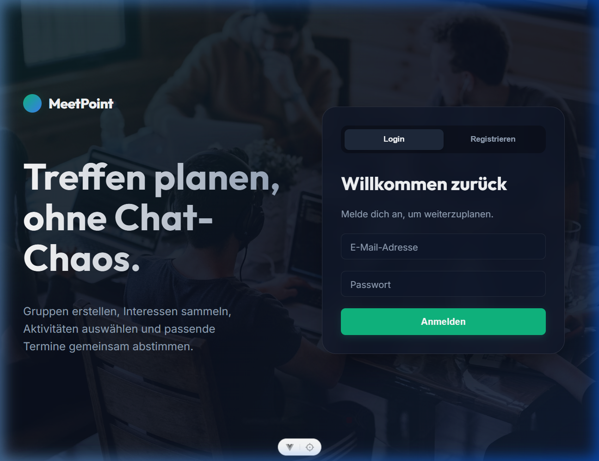
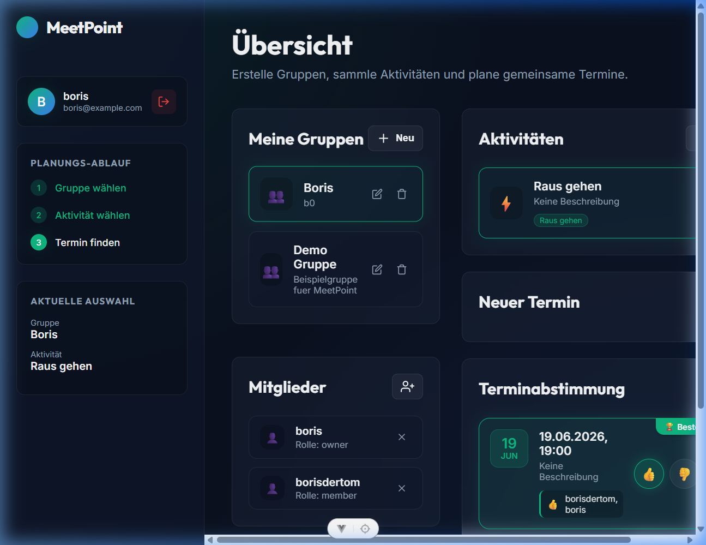
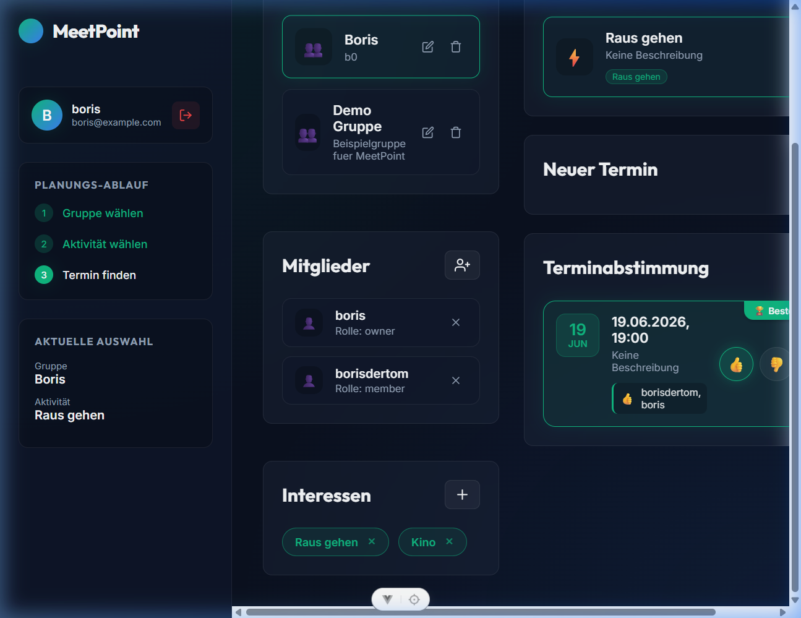

# MeetPoint 🎯 – Treffen planen, ohne Chat-Chaos

**MeetPoint** ist eine moderne, responsive Web-Applikation zur unkomplizierten Terminfindung und Aktivitätsplanung für Freundesgruppen. Sie wurde im Rahmen des Moduls **M 306 (IT-Kleinprojekt realisieren)** entwickelt, um die typische Flut an unübersichtlichen Messenger-Nachrichten bei der gemeinsamen Freizeitplanung zu beseitigen.

---

## 📸 Screenshots & Benutzeroberfläche

### 1. Login- & Registrierungsbereich
Über die moderne Login-Oberfläche können sich Benutzer registrieren und mit ihrem Account anmelden.


### 2. Dashboard & Gruppenübersicht
Nach dem Login gelangt der Benutzer auf sein Dashboard. Hier sieht er alle Gruppen, in denen er Mitglied oder Besitzer ist, und kann neue Gruppen anlegen.


### 3. Aktivitätsplanung & Terminabstimmung
In einer Gruppe können Interessen gesammelt, Aktivitäten vorgeschlagen und Termine per Daumen-Voting (👍 / 👎) bewertet werden. Die App ermittelt live und in Echtzeit den Sieger-Termin.


---

## 🚀 Kern-Features

- **Gruppen- & Mitgliederverwaltung:** Erstelle Themengruppen (z.B. "Sommerferien-Crew", "Sport-Freunde") und füge Mitglieder hinzu.
- **Interessen-Tracking:** Weise Gruppen Interessen-Tags zu (z.B. "Sport", "Essen", "Kultur"), um passende Aktivitäten zu planen.
- **Reaktives Abstimmungssystem:** Stimmt live für verschiedene Terminvorschläge ab. Die App markiert den optimalen Termin sofort mit einem goldenen Pokal (**🏆 Bester Termin**).
- **Sicherheitskonzept (Data Integrity):** Nur der Gruppenbesitzer (Owner) oder der Ersteller (Creator) eines Eintrags kann diesen löschen.
- **Modernes Dark-Theme:** Augenschonendes Dark-Mode-Design mit modernem **Glassmorphism-Effekt** und flüssigen Mikro-Animationen.

---

## 🛠️ Technologie-Stack (Architecture)

Das Projekt ist als reaktionsschnelle Single-Page-Application (SPA) mit einer sauberen Trennung von Frontend und Backend aufgebaut:

* **Frontend:**
  * **Vue.js 3** (Composition API mit TypeScript) für reaktive und modulare UI-Komponenten.
  * **Vite** als moderner und extrem schneller Build-Tool.
  * **Custom Vanilla CSS** für volle Designkontrolle (ohne aufgeblähte CSS-Frameworks).
* **Backend & API:**
  * **PostgreSQL** als relationale Datenbank zur Speicherung aller relationalen Strukturen.
  * **PostgREST** im Docker-Container, um direkt und automatisch eine REST-API aus dem PostgreSQL-Schema bereitzustellen.
  * **Docker & Docker Compose** für die einfache und konsistente lokale Bereitstellung.

---

## 🔐 Sicherheitskonzept (Row-Level Security)

Da es sich bei diesem Projekt um ein MVP (Minimum Viable Product) handelt, wurde aus Zeitgründen auf eine vollwertige Token-Authentifizierung (JWT) verzichtet. Um die Datenintegrität dennoch zuverlässig zu schützen, wurde ein robustes Berechtigungskonzept implementiert:

1. **Gesperrte DELETE-Schnittstelle:** Der PostgREST-API wurden direkte Schreibrechte für Tabellen-Löschungen entzogen.
2. **Datenbank-RPCs (Stored Procedures):** Löschvorgänge erfolgen ausschliesslich über sichere PostgreSQL-Funktionen (z.B. `delete_group`, `delete_activity`, `delete_appointment`).
3. **Serverseitige Prüfung:** Bei jedem Aufruf prüft die Datenbank intern und absolut manipulationssicher, ob der übertragene Benutzer der Ersteller des Eintrags oder der Besitzer der übergeordneten Gruppe ist. Erst nach dieser Validierung wird die Löschung ausgeführt.

---

## ⚙️ Lokales Setup (Starten der App)

Folge diesen Schritten, um MeetPoint lokal auf deinem Computer auszuführen.

### Voraussetzungen
* Installiertes **Node.js** (Version 18 oder neuer)
* Installiertes **Docker Desktop**

### Schritt 1: Backend & Datenbank starten
Das Backend läuft vollständig in Docker. Gehe in das Backend-Verzeichnis und starte die Container:
```bash
cd backend-src
docker compose up -d
```
*Die PostgreSQL-Datenbank und die PostgREST-API starten automatisch. Die Datenbanktabellen und Trigger werden beim ersten Start selbstständig aus den SQL-Dateien im Ordner `backend-src/database` geladen.*

### Schritt 2: Frontend starten
Gehe in das Frontend-Verzeichnis, installiere die Abhängigkeiten und starte den Entwicklungsserver:
```bash
cd ../frontend-src/meetpoint
npm install
npm run dev
```

### Schritt 3: App im Browser öffnen
Die Web-App ist nun unter folgendem Link erreichbar:
👉 **[http://localhost:5173](http://localhost:5173)**

---

## 🔑 Test-Zugangsdaten (Credentials)

Für Test- und Bewertungszwecke sind in der Datenbank bereits einige Benutzer und Gruppen vorbereitet. Alle Testbenutzer verwenden das gleiche Passwort:

* **Haupt-Testaccount (Gruppen-Besitzer):**
  * **E-Mail:** `boris@example.com`
  * **Passwort:** `MeetPoint123`
* **Mitglieder-Testaccounts (zum Testen von Gegenstimmen / Berechtigungen):**
  * `dmytro@example.com` (Passwort: `MeetPoint123`)
  * `fabio@example.com` (Passwort: `MeetPoint123`)
  * `noel@example.com` (Passwort: `MeetPoint123`)

---

## 👨‍💻 Arbeitsmethodik & Reflexion (KI-Einsatz)

Aufgrund des sehr engen Zeitrahmens in diesem Modul haben wir uns entschieden, modernste KI-Entwicklungshelfer (AI-Assisted Coding) einzusetzen. 

Dies ermöglichte uns ein schnelles Prototyping, die fehlerfreie Erstellung komplexer relationaler SQL-Datenbankschemata und die automatische Validierung von Berechtigungen auf Datenbankebene (RPCs). Wir betrachten den transparenten und gezielten Einsatz von KI-Assistenten als zeitgemässe und wertvolle Kompetenz im modernen Software-Engineering, um Produktivität und Code-Qualität signifikant zu steigern.
